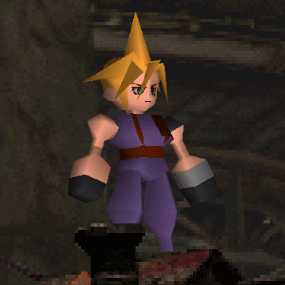
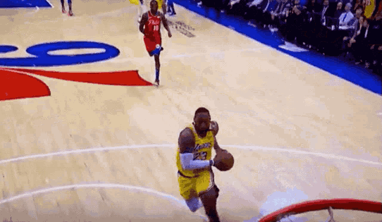

# Índice

- [Presentación](#Presentación)
- [Enseñanzas](#Enseñanzas)
- [Trabajo](#trabajo)
- [Aficiones](#aficiones)
- [Contacto](#contacto)
  - [Correo Electronico](#correo-electrónico)
- [Fin](#fin)
# Presentación
### Hola! Soy Kevin, tengo 18 años y estoy en 1º de DAM en el IES Luis Vives. 

  

# Enseñanzas
### En lo relacionado a la programación, estoy aprendiendo a utilizar GitHub y otras herramientas, como Visual Studio Code o IntelliJ IDEA. Además estoy aprendiendo a manejar el lenguaje Kotlin. También tengo conocimientos básicos de GIT🙂. 

# Trabajo
### Hasta el momento no tengo ninguna experiencia laboral.

# Aficiones
### Entre mis aficiones son en deporte, mis favoritos son el fútbol⚽ y el baloncesto🏀. También me gustan los videojuegos🎮 como Pokémon, Final Fantasy o juegos relaionados con los deportes que me gustan, como FIFA o NBA 2K.

   

# Contacto
[Twitter](https://twitter.com/KekiMatute)

[LinkedIn](https://www.linkedin.com/in/kevin-david-matute-obando-2230a3252/)

### Correo electrónico
kekimat12@gmail.com

# FIN

    

