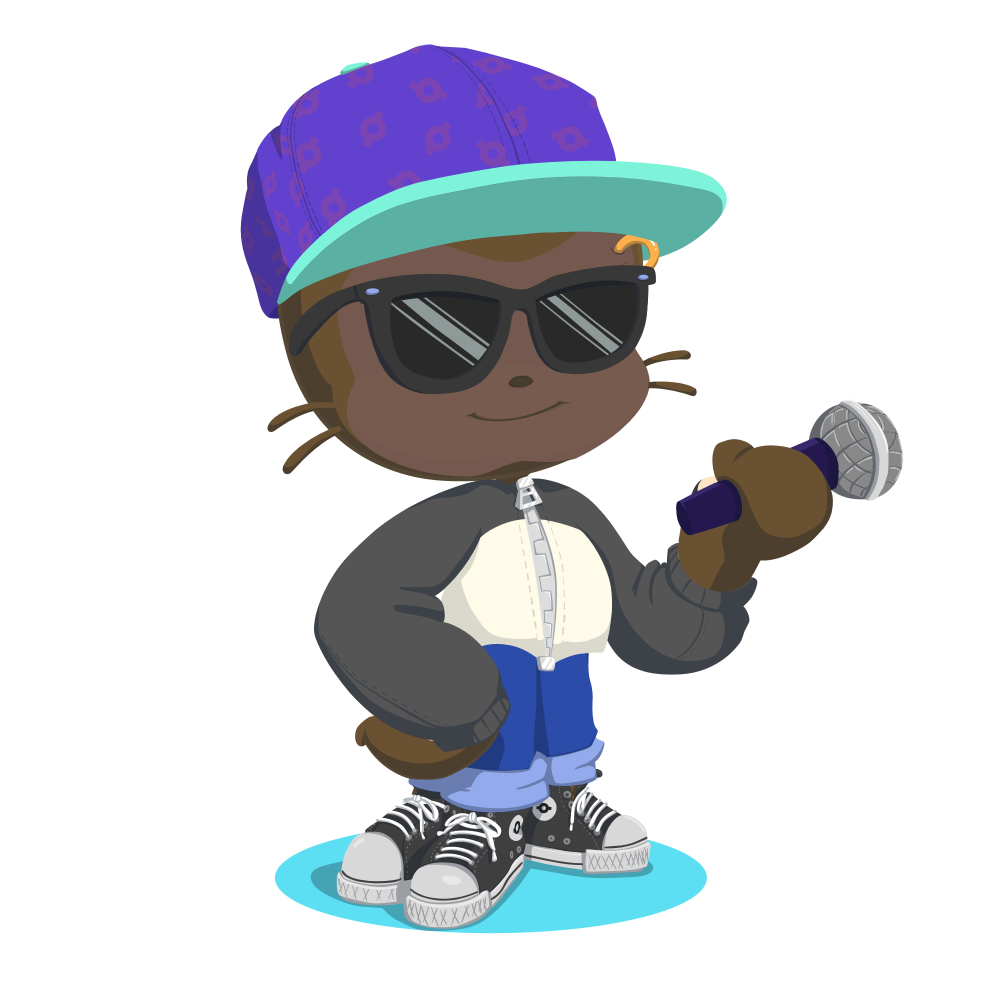

# Presentación
### Hola! Soy Kevin un estudiante de 1º de DAM en el IES Luis Vives. 

  

# Enseñanzas
### Estoy aprendiendo a utilizar GitHub y otras herramientas relacionadas con la programación, como Visual Studio Code o IntelliJ IDEA. También tengo conocimientos básicos de GIT.🙂

# Trabajo
### Hasta el momento no tengo ninguna experiencia laboral.

# Aficiones
### Entre mis aficiones son en deporte, mis favoritos son el fútbol⚽ y el baloncesto🏀. También me gustan los videojuegos🎮 como Pokémon, Final Fantasy o juegos relaionados con los deportes que me gustan, como FIFA o NBA 2K.

   

# Contacto
[Twitter](https://twitter.com/KekiMatute)

[LinkedIn](https://www.linkedin.com/in/kevin-david-matute-obando-2230a3252/)

### Correo electrónico
kekimat12@gmail.com
